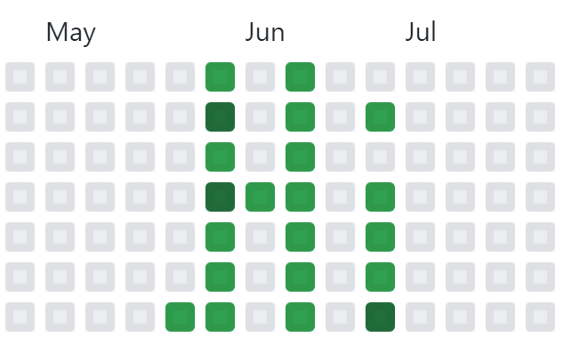

# 🎨 GitArt


This project is used to display messages and making art using GitHub's commit chart.


## Installation

 Clone the repository by ``` git clone https://github.com/MrRandomGenerator/GitArt.git```

## Usage

1. Change the upload schedule.
2. Set the git and the repository in the execution environment.
2. Run ```main.py``` in your environment, until the last specified date.

## Contributing
Pull requests are welcomed. For major changes, please open an issue first to discuss what you would like to change.

## License
[MIT](https://choosealicense.com/licenses/mit/)
 
